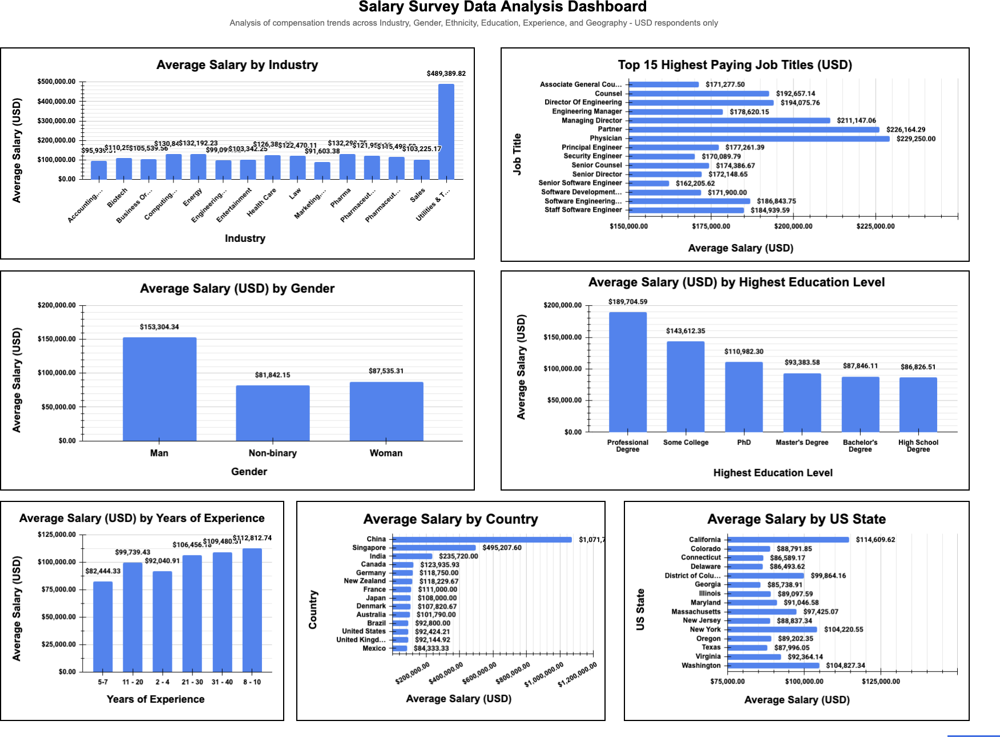
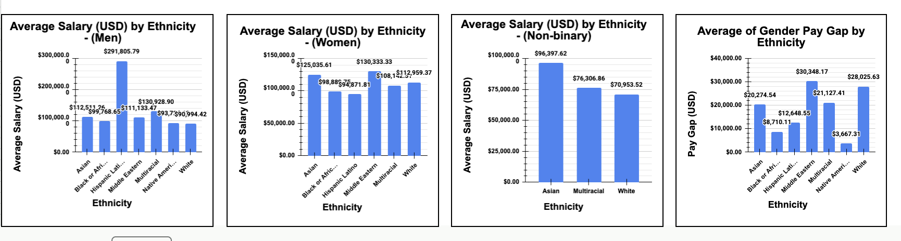

# salary-survey-analysis

Analysis of 26,583 salary survey records exploring compensation trends  across industry, gender, ethnicity, education, experience, and geography  using SQL (BigQuery) and Google Sheets.

## Overview

This project analyzes self-reported compensation data across industry, experience, education, gender, ethnicity, job title, and geography to identify patterns in pay and compensation equity. Data was cleaned and standardized in Google Sheets, queried in BigQuery using SQL, and visualized through pivot tables and charts.

## Data Cleaning

- Standardized inconsistent text fields (country names, education levels, job titles) using TRIM, PROPER and Find & Replace
- Removed currency symbols and commas from salary figures and cast to numeric type
- Filtered analysis to USD respondents only for fair salary comparison
- Excluded salaries above $500,000 as statistical outliers
- Applied a minimum group size of 10 respondents per category to avoid misleading averages from small samples
- Lowered minimum threshold to 5 for country level analysis to maintain geographic representation
- Re-uploaded as TSV after discovering embedded commas in text fields were breaking CSV parsing in BigQuery

## Key Findings

- **Industry pay gap:** Approximately $300,000 spread between the highest and lowest paying industries
- **Experience:** Respondents with 8-10 years of experience averaged $112,812 — higher than the $99,739 average for those with 11-20 years, suggesting industry and role matter more than tenure alone
- **Education:** Professional degree holders earned the most while Some College respondents unexpectedly outearned PhD holders — pointing to high earners in trades or self taught technical fields
- **Gender pay gap:** Men averaged $153,303 vs $87,535 for women — a $65,768 gap representing women earning approximately 57 cents for every dollar earned by men
- **Ethnicity and gender:** Middle Eastern respondents showed the largest gender pay gap while Native American respondents showed the smallest pay gap
- **Job titles:** Physician was the highest paying title at $229,250 average — all top 15 titles exceeded $160,000
- **Geography:** California had the highest average state salary at $114,610 while Georgia reported the lowest among top 15 states at $85,739
- ** Non-binary respondents reported the lowest average salary at $81,842 — below both male and female averages — suggesting compounding compensation disadvantages for non-binary identifying professionals

## Limitations

- Self reported data may contain inaccuracies or selection bias toward higher paying white collar roles
- Currency restricted to USD only — excludes a portion of international respondents
- Cross sectional data with no ability to track individual salary progression over time
- Dataset skews toward high earning professional roles which may not represent the broader workforce

## Dashboard Preview

